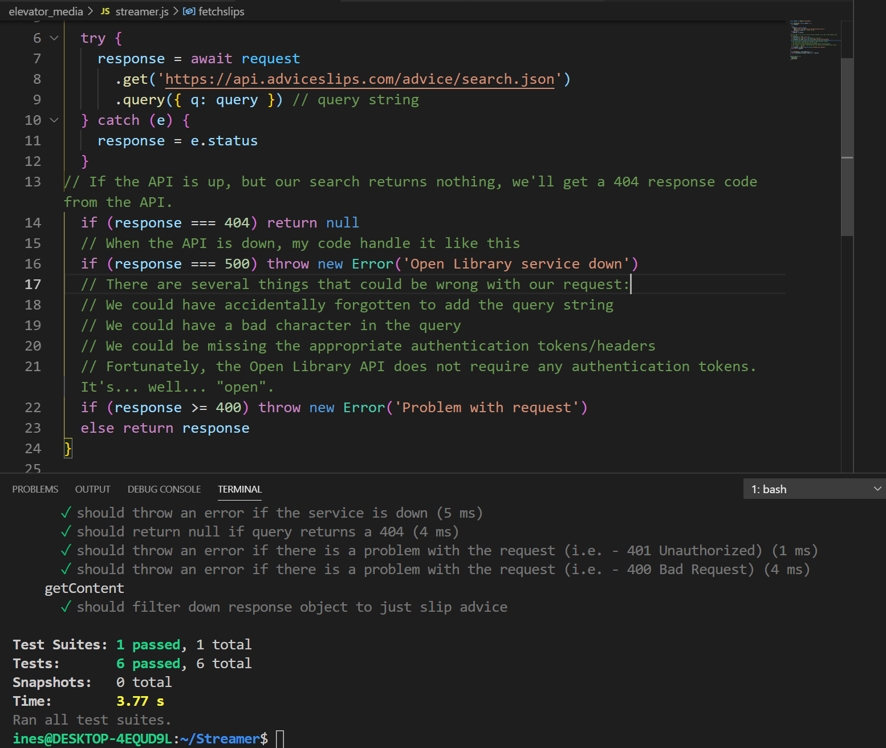

# TDD(test-driven development) Week #
 
Milestones for this week:
(Red, green, Factoring explained and Unit Tests)
 
The practice of test-based development is to follow a backwards approach as follows:
1.	Write a test that fails
2.	Pass it on
3.	Refactoring your code.
 
 

[Here is url for more details in rubi using spec](https://github.com/InesIzere/TDD). 
 the difference between the ruby testing is that i have considered if the external api has problem(not responding, is down or not accessible or return nothing)

 

